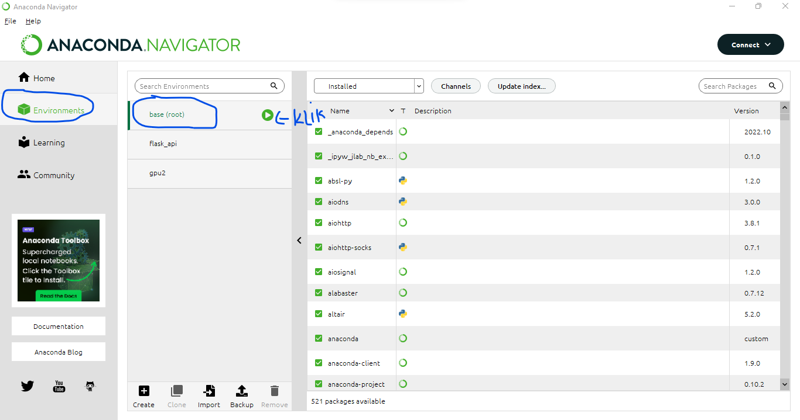

# Instruksi untuk Menjalankan Dashboard Aplikasi Sederhana

Berikut adalah beberapa tahapan yang harus dilakukan sebelum menjalankan Aplikasi Dashboard sederhana yang telah dibuat menggunakan Library Streamlit:

1. Pertama-tama Pastikan Bahasa Pemrograman Python sudah di-install pada laptop kita.
2. Karena saya membuat dashboard sederhana menggunakan Anaconda Navigator dengan bantuan Environment Anaconda, maka anda harus meng-install Anaconda Navigator terlebih dahulu.
3. Sebelum menjalankan Aplikasi Dashboard, Anda harus meng-install library Streamlit di dalam Anaconda Prompt atau Command Prompt dengan cara "pip install Streamlit".
4. Jika sudah meng-install Anaconda Navigator & Bahasa Pemrograman Python, Anda dapat pergi ke fitur Environment Anaconda -> klik kanan pada base (root) -> pilih Open Terminal

5. Buka sub-folder Dashboard yang ada di dalam folder utama yaitu "BikeSharingDatasetSubmission" dan copy lokasi dari sub-folder Dashboard.
6. Jika terminal Environment Anaconda Navigator sudah terbuka, maka paste lokasi dari sub-folder Dashboard dan jangan lupa untuk mengawali dengan "cd". Hasilnya akan menjadi seperti ini
"cd C:\Users\ekapr\File Notebook Python\Projek Submission Dicoding\BikeSharingDatasetSubmission\Dashboard"
7. Jika sudah di-paste dan di-enter, maka tulis perintah "Streamlit run DashboardSubmission.py" pada terminal Anaconda Navigator dan tunggu sampai Aplikasi Website Dashboard Sederhana terbuka!!

Terima Kasih